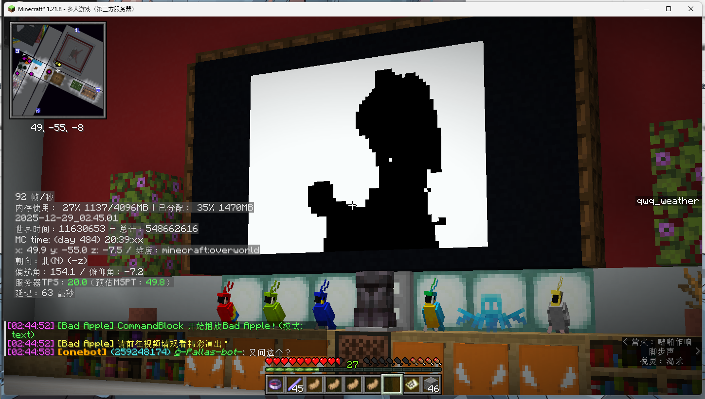
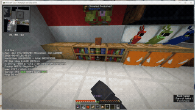

> **[📖 English](README.md)**
> **[📖 中文](README-zh.cn.md)**

# 🎬🍎🧱📝 spigot-plugin-bad-apple

> 🎬 Minecraft Spigot 服务端插件，可灵活配置。用方块或 TextDisplay 实体在游戏内播放 Bad Apple 视频。🍎✨

[](https://github.com/VincentZyuApps/spigot-plugin-bad-apple)
[](https://gitee.com/vincent-zyu/spigot-plugin-bad-apple)

[](https://www.spigotmc.org/)
[](https://papermc.io/)

[](https://openjdk.org/)
[](https://gradle.org)
[](https://github.com/VincentZyuApps/spigot-plugin-bad-apple/actions)

[](https://qm.qq.com/q/4vjto4V7Di)

<p><del>💬 插件使用问题 / 🐛 Bug反馈 / 👨‍💻 插件开发交流，欢迎加入QQ群：<b>259248174</b>   🎉（这个群G了</del> </p>
<p>💬 插件使用问题 / 🐛 Bug反馈 / 👨‍💻 插件开发交流，欢迎加入QQ群：<b>1085190201</b> 🎉</p>
<p>💡 在群里直接艾特我，回复的更快哦~ ✨</p>

---

## 🌟 功能特性

> 插件内置的视频帧压缩包已经预处理好，并会在运行时从插件 JAR 里读取加载。

| 功能 | 命令 | 说明 |
|------|------|------|
| 🧱 **方块模式** | `/play_bad_apple block` | 用黑白混凝土方块在墙面上渲染视频画面 |
| 📝 **文本模式** | `/play_bad_apple text` | 用 TextDisplay 实体渲染更密集的视频像素屏幕 |
| ⏹️ **停止播放** | `/stop_bad_apple <text\|block>` | 停止播放、清除冷却，并按配置决定是否清理方块或实体 |

> 插件会把 `assets/bin_96x54_10fps.zip` 打包进 JAR，并在播放前预加载全部帧数据到内存。
> 指令触发与物理触发都可以在配置里分别启用或关闭。

### 🖼️ 效果预览

> 游戏内客户端截图



> 游戏内动态效果预览



### 🗺️ 支持情况

> 当前仓库默认值已经按生产环境 [`0.2.4-rc1`](https://github.com/VincentZyuApps/spigot-plugin-bad-apple/releases/tag/0.2.4-rc1) 风格对齐到同一套资源布局和配置结构。

| | |
|---|---|
| 🎯 **服务端类型** | [](https://www.spigotmc.org/) [](https://papermc.io/) |
| 🧱 **服务端 API** | [](https://www.spigotmc.org/) |
| 📝 **语言** | [](https://openjdk.org/) |
| 🏗 **构建** | [](https://gradle.org) |
| 🔄 **CI** | [](https://github.com/VincentZyuApps/spigot-plugin-bad-apple/actions) |

---

## 📦 下载与安装

| | |
|---|---|
| 🧱 **插件 Jar** | [](https://github.com/VincentZyuApps/spigot-plugin-bad-apple/releases) |
| 🎵 **资源包 Zip** | [](https://github.com/VincentZyuApps/spigot-plugin-bad-apple/releases/tag/bad-apple-music-resource-pack) |

将生成好的 `.jar` 文件放进服务器 `plugins/` 目录后重启即可。
如果你需要音频播放，还需要额外下载资源包 Release：[bad-apple-music-resource-pack](https://github.com/VincentZyuApps/spigot-plugin-bad-apple/releases/tag/bad-apple-music-resource-pack)。

默认配置如下：

```yml
# 🎬🍎 Bad Apple Plugin Configuration 🧱📝

# 🎥 全局画面设置 📺
video_settings:
  # 🔄 是否在读取bin文件时进行水平翻转（镜像）
  # true: 画面左右翻转，false: 保持原始画面
  horizontal_flip: true

# 🧱 视频播放墙体配置 (block模式) 🧊
video_wall:
  # 📍 墙体左下角方块的坐标
  position:
    x: -20
    y: 0
    z: -70
  # 🧭 墙体朝向 (NORTH, SOUTH, EAST, WEST)
  direction: NORTH

# 📝 视频播放文本展示配置 (text模式) 🖥️
video_text:
  # 📍 文本展示左下角的坐标
  position:
    x: 44.5
    y: -51.13
    z: -18.913
  # 🧭 墙体朝向 (NORTH, SOUTH, EAST, WEST)
  direction: SOUTH
  # 🔄 是否启用双面显示（背靠背实体）
  enableBothSide: false
  
# ▶️ 播放设置 ⏱️
playback:
  # ✅ 是否启用视频播放功能
  enabled: true
  # ⏳ 播放冷却时间（秒）
  cooldown: 235  # ⏰ 3分55秒
  # 🔊 是否启用音频播放控制
  enableAudio: false
  # 🆔 资源包中的声音 ID，例如 niacl:music_disc.bad_apple
  audioSoundId: niacl:music_disc.bad_apple

# 🧹 清理设置 🗑️
cleanup:
  # 🧊 Block 模式清理配置
  block:
    # ✅ 播放完毕后是否清除方块（3分55秒后）
    clear_on_complete: true
    # 🛑 手动停止播放后是否清除方块（stop命令或黑色压力板）
    clear_on_stop: true
  
  # 🖥️ Text 模式清理配置
  text:
    # ✅ 播放完毕后是否清除文本展示实体（3分55秒后）
    clear_on_complete: true
    # 🛑 手动停止播放后是否清除文本展示实体（stop命令或黑色按钮）
    clear_on_stop: true

# 🔘 按钮控制：使用两个按钮控制播放/停止（text 模式）
controls:
  # 🔇 声音延迟（tick）。例如10 tick ≈ 0.5秒
  sound_delay_ticks: 1

# 🎮 触发方式配置 ⚡
triggers:
  # 🧊 Block 模式触发配置
  block:
    # ⌨️ 允许通过指令触发 block 模式的开始
    command_start_enabled: true
    # ⌨️ 允许通过指令触发 block 模式的停止
    command_stop_enabled: true
    # 🟫 允许通过压力板触发 block 模式的开始
    pressure_plate_start_enabled: true
    # 🟫 允许通过压力板触发 block 模式的停止
    pressure_plate_stop_enabled: true
  
  # 🖥️ Text 模式触发配置
  text:
    # ⌨️ 允许通过指令触发 text 模式的开始
    command_start_enabled: true
    # ⌨️ 允许通过指令触发 text 模式的停止
    command_stop_enabled: true
    # 🔴 允许通过按钮触发 text 模式的开始
    button_start_enabled: true
    # 🔴 允许通过按钮触发 text 模式的停止
    button_stop_enabled: true
```

配置说明：

- `video_settings.horizontal_flip`：解码帧压缩包时是否水平镜像
- `video_wall.position`：方块模式的左下角方块坐标
- `video_text.position`：文本模式的左下角锚点坐标
- `playback.cooldown`：重复播放前的共享冷却时间
- `playback.audioSoundId`：客户端资源包里的声音标识，需包含命名空间，例如 `niacl:music_disc.bad_apple`
- `cleanup.*`：控制播放完毕或手动停止后是否清理方块或实体
- `triggers.*`：分别控制指令、压力板、按钮触发是否启用

---

## 🔧 构建

### 本地构建

```bash
./gradlew build
```

产物 JAR 会生成在 `build/libs/` 目录下。

### GitHub Actions

[](https://github.com/VincentZyuApps/spigot-plugin-bad-apple/actions)

push 到 `main` 或 `master` 时，可以用 commit 关键词控制 CI：

| 关键字 | 行为 |
|--------|------|
| `build action` | 构建插件并上传 artifact |
| `build release` | 构建插件并发布 GitHub Release |

示例：

```bash
git commit -m "feat: sync bundled video archive and config; build action"
git commit -m "build release. chore: publish bad apple plugin release"
```

PR 到 `main` 或 `master` 时也会触发构建，但不会自动发布 release。
