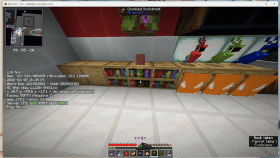

> **[📖 English](README.md)**
> **[📖 中文](README-zh.cn.md)**

# 🎬🍎🧱📝 spigot-plugin-bad-apple

> 🎬 A flexible Spigot plugin for playing Bad Apple in Minecraft using blocks or TextDisplay entities. 🍎✨

[](https://github.com/VincentZyuApps/spigot-plugin-bad-apple)
[](https://gitee.com/vincent-zyu/spigot-plugin-bad-apple)

[](https://www.spigotmc.org/)
[](https://papermc.io/)

[](https://openjdk.org/)
[](https://gradle.org)
[](https://github.com/VincentZyuApps/spigot-plugin-bad-apple/actions)

[](https://qm.qq.com/q/4vjto4V7Di)

<p><del>💬 Plugin usage / 🐛 Bug reports / 👨‍💻 Development discussion — Join our QQ Group: <b>259248174</b> 🎉 (This group is gone)</del></p>
<p>💬 Plugin usage / 🐛 Bug reports / 👨‍💻 Development discussion — Join our QQ Group: <b>1085190201</b> 🎉</p>
<p>💡 Mention me in the group for faster replies ~ ✨</p>

---

## 🌟 Features

> The bundled video frame archive is preprocessed and loaded from the plugin JAR at runtime.

| Feature | Command | Description |
|------|------|------|
| 🧱 **Block Mode** | `/play_bad_apple block` | Renders the video on a wall using black and white concrete blocks |
| 📝 **Text Mode** | `/play_bad_apple text` | Renders the video using TextDisplay entities for a denser pixel screen |
| ⏹️ **Stop Playback** | `/stop_bad_apple <text\|block>` | Stops playback, clears cooldown, and optionally cleans blocks or entities |

> The plugin ships with `assets/bin_96x54_10fps.zip` inside the JAR and preloads all frames into memory before playback.
> Both command triggers and physical triggers can be controlled independently from the config.

### 🖼️ Preview

> In-game client screenshot


> Animated in-game preview



### 🗺️ Support

> Current repository defaults are aligned to the production [`0.2.4-rc1`](https://github.com/VincentZyuApps/spigot-plugin-bad-apple/releases/tag/0.2.4-rc1) style resource layout and config structure.

| | |
|---|---|
| 🎯 **Server Type** | [](https://www.spigotmc.org/) [](https://papermc.io/) |
| 🌎 **Tested API** |  |
| 📦 **Runtime** |  |

---

## 🛠 Tech Stack

| | |
|---|---|
| 🧱 **Server API** | [](https://www.spigotmc.org/) |
| 📝 **Language** | [](https://openjdk.org/) |
| 🏗 **Build** | [](https://gradle.org) |
| 🔄 **GitHub Action CI** | [](https://github.com/VincentZyuApps/spigot-plugin-bad-apple/actions) |

---

## 📦 Download & Install

[](https://github.com/VincentZyuApps/spigot-plugin-bad-apple/releases)
[](https://github.com/VincentZyuApps/spigot-plugin-bad-apple/releases/tag/bad-apple-music-resource-pack)

Place the generated `.jar` file into the server `plugins/` directory and restart the server.
If you want audio playback, also download the resource pack release: [bad-apple-music-resource-pack](https://github.com/VincentZyuApps/spigot-plugin-bad-apple/releases/tag/bad-apple-music-resource-pack).

Default config:

```yml
# 🎬🍎 Bad Apple Plugin Configuration 🧱📝

# 🎥 全局画面设置 📺
video_settings:
  # 🔄 是否在读取bin文件时进行水平翻转（镜像）
  # true: 画面左右翻转，false: 保持原始画面
  horizontal_flip: true

# 🧱 视频播放墙体配置 (block模式) 🧊
video_wall:
  # 📍 墙体左下角方块的坐标
  position:
    x: -20
    y: 0
    z: -70
  # 🧭 墙体朝向 (NORTH, SOUTH, EAST, WEST)
  direction: NORTH

# 📝 视频播放文本展示配置 (text模式) 🖥️
video_text:
  # 📍 文本展示左下角的坐标
  position:
    x: 44.5
    y: -51.13
    z: -18.913
  # 🧭 墙体朝向 (NORTH, SOUTH, EAST, WEST)
  direction: SOUTH
  # 🔄 是否启用双面显示（背靠背实体）
  enableBothSide: false
  
# ▶️ 播放设置 ⏱️
playback:
  # ✅ 是否启用视频播放功能
  enabled: true
  # ⏳ 播放冷却时间（秒）
  cooldown: 235  # ⏰ 3分55秒
  # 🔊 是否启用音频播放控制
  enableAudio: false
  # 🆔 资源包中的声音 ID，例如 niacl:music_disc.bad_apple
  audioSoundId: niacl:music_disc.bad_apple

# 🧹 清理设置 🗑️
cleanup:
  # 🧊 Block 模式清理配置
  block:
    # ✅ 播放完毕后是否清除方块（3分55秒后）
    clear_on_complete: true
    # 🛑 手动停止播放后是否清除方块（stop命令或黑色压力板）
    clear_on_stop: true
  
  # 🖥️ Text 模式清理配置
  text:
    # ✅ 播放完毕后是否清除文本展示实体（3分55秒后）
    clear_on_complete: true
    # 🛑 手动停止播放后是否清除文本展示实体（stop命令或黑色按钮）
    clear_on_stop: true

# 🔘 按钮控制：使用两个按钮控制播放/停止（text 模式）
controls:
  # 🔇 声音延迟（tick）。例如10 tick ≈ 0.5秒
  sound_delay_ticks: 1

# 🎮 触发方式配置 ⚡
triggers:
  # 🧊 Block 模式触发配置
  block:
    # ⌨️ 允许通过指令触发 block 模式的开始
    command_start_enabled: true
    # ⌨️ 允许通过指令触发 block 模式的停止
    command_stop_enabled: true
    # 🟫 允许通过压力板触发 block 模式的开始
    pressure_plate_start_enabled: true
    # 🟫 允许通过压力板触发 block 模式的停止
    pressure_plate_stop_enabled: true
  
  # 🖥️ Text 模式触发配置
  text:
    # ⌨️ 允许通过指令触发 text 模式的开始
    command_start_enabled: true
    # ⌨️ 允许通过指令触发 text 模式的停止
    command_stop_enabled: true
    # 🔴 允许通过按钮触发 text 模式的开始
    button_start_enabled: true
    # 🔴 允许通过按钮触发 text 模式的停止
    button_stop_enabled: true
```

Config notes:

- `video_settings.horizontal_flip`: mirrors the loaded frame archive while decoding
- `video_wall.position`: lower-left block coordinate for block playback
- `video_text.position`: lower-left anchor position for text playback
- `playback.cooldown`: shared cooldown for replaying the video
- `playback.audioSoundId`: sound identifier from the client resource pack, including namespace such as `niacl:music_disc.bad_apple`
- `cleanup.*`: control whether blocks or entities are removed after playback or manual stop
- `triggers.*`: enable or disable command, pressure plate, and button triggers independently

---

## 🔧 Build

### Local Build

```bash
./gradlew build
```

The output JAR is generated under `build/libs/`.

### GitHub Actions

[](https://github.com/VincentZyuApps/spigot-plugin-bad-apple/actions)

Push to `main` or `master` and use commit keywords to control CI:

| Keyword | Behavior |
|--------|------|
| `build action` | Build the plugin and upload the artifact |
| `build release` | Build the plugin and publish a GitHub Release |

Example:

```bash
git commit -m "feat: sync bundled video archive and config; build action"
git commit -m "build release. chore: publish bad apple plugin release"
```

Pull requests to `main` or `master` also run the build job, but do not publish releases.
